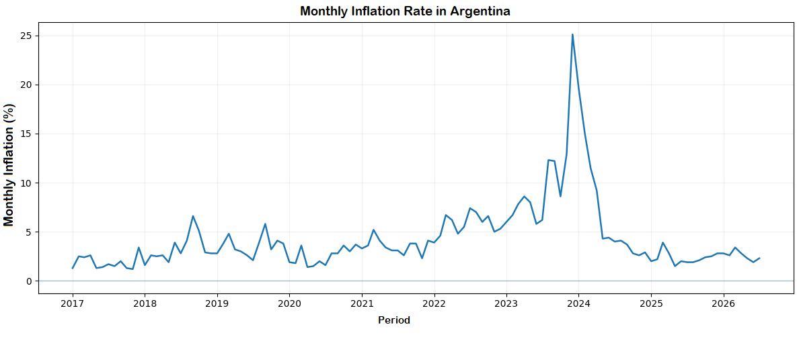
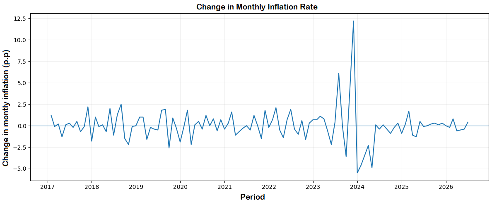
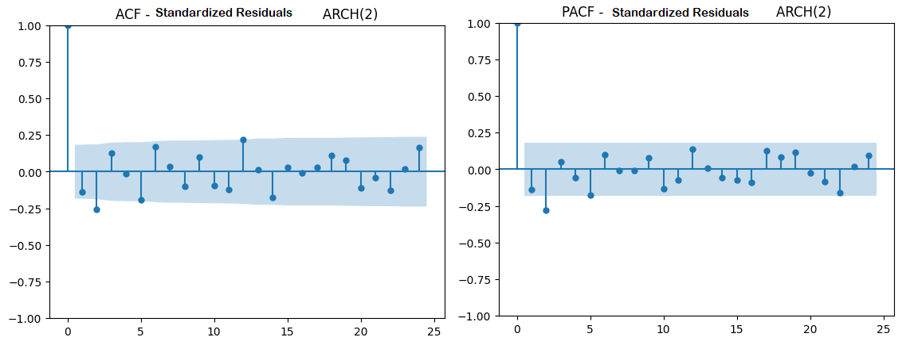
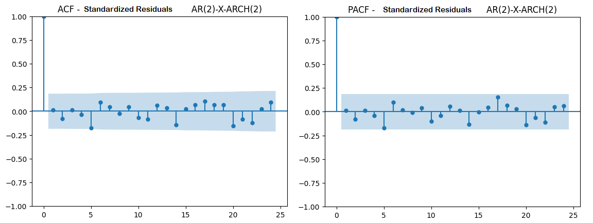
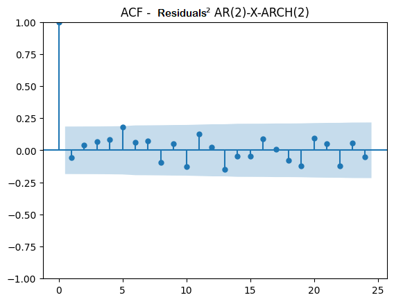
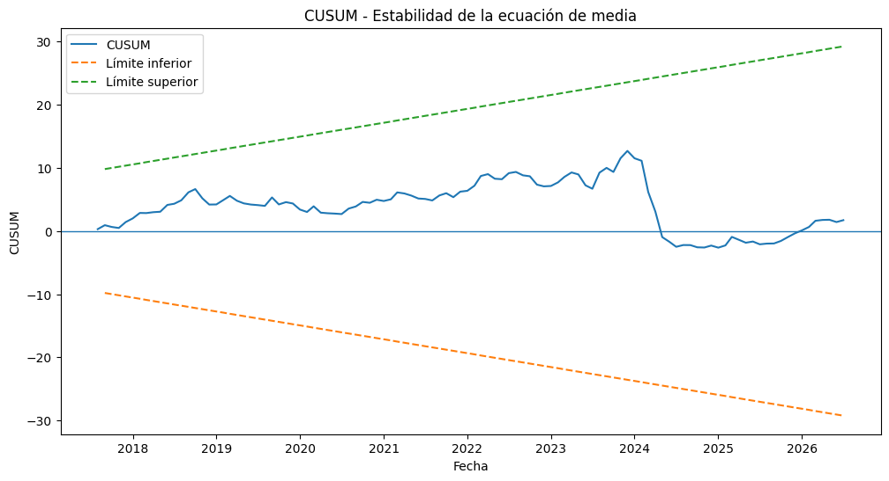

# Modeling Inflation Dynamics in Argentina

*Econometric analysis of the relationship between exchange-rate movements and inflation dynamics in Argentina using time-series models.*

This project develops a time-series model to analyze inflation dynamics in Argentina and examine their relationship with monthly exchange-rate movements.

The modeling strategy is inspired by the iterative **identification–estimation–diagnostic checking** logic of the Box–Jenkins methodology. Rather than focusing on forecasting, the analysis uses this iterative process to investigate the following research question:

> **Are monthly exchange-rate movements associated with changes in Argentina's inflation rate, and what are the temporal dynamics of this relationship?**

The analysis examines the stationarity properties of the series, identifies the dynamics of the conditional mean, tests for conditional heteroskedasticity, compares alternative model specifications, and evaluates the selected model through residual diagnostics.

The resulting specification is an **AR(2)-X-ARCH(2) model**, in which the change in monthly inflation is modeled using two autoregressive terms and the contemporaneous monthly percentage change in the exchange rate, while an ARCH(2) process captures conditional volatility.

The model is intended to characterize **statistical associations and temporal dynamics**, rather than identify a causal effect of exchange-rate movements on inflation.

## Data

The analysis uses **115 monthly observations covering the period from January 2017 to July 2026**, obtained from two official Argentine sources:

- **Consumer Price Index (CPI):** obtained from Argentina's National Institute of Statistics and Censuses (INDEC) and used to calculate the monthly inflation rate.
- **Exchange rate:** obtained from the Central Bank of Argentina (BCRA) and transformed into its monthly percentage variation.

The dataset was organized at a monthly frequency and checked for missing values and date consistency before the econometric analysis.

The main variables used in the modeling process are:

- `inflacion_mensual`: monthly inflation rate derived from the CPI.
- `variacion_dolar`: monthly percentage change in the exchange rate.
- `delta_inflacion`: change in the monthly inflation rate.

The latter is defined as:
Δπₜ = πₜ − πₜ₋₁

Therefore, `delta_inflacion` captures the **acceleration or deceleration of monthly inflation**, measured in percentage points.

## Tools and Technologies

- **Python**
  - **pandas** — data cleaning, transformation, and time-series preparation
  - **NumPy** — numerical operations
  - **statsmodels** — stationarity tests, ARIMA/ARIMAX estimation, Granger causality, Ljung–Box tests, and CUSUM diagnostics
  - **arch** — ARCH/GARCH estimation and volatility modeling
  - **Matplotlib** — time-series and diagnostic visualizations

---

## Methodology

The modeling strategy draws inspiration from the **Box–Jenkins methodology**, particularly its iterative logic of identification, estimation, diagnostic checking, and model re-specification.

Because the objective of this project is explanatory rather than forecasting-oriented, the forecasting stage was omitted.

The analysis followed the following process:

1. **Data preparation and transformation**
   - Monthly frequency and date consistency were verified.
   - CPI data were transformed into monthly inflation rates.
   - The exchange rate was transformed into monthly percentage changes.

2. **Stationarity analysis**
   - Augmented Dickey–Fuller (ADF) and KPSS tests were applied to assess the stationarity properties of the variables used in the analysis.
   - The monthly inflation rate (`inflacion_mensual`) showed ambiguous/non-stationary behavior.
   - The monthly inflation rate was therefore first-differenced, producing `delta_inflacion`, which measures the month-to-month change in the inflation rate in percentage points. This transformed series was found to be stationary.
   - For the exchange rate, the analysis used its monthly percentage variation (`variacion_dolar`) rather than the exchange-rate level. This series was found to be stationary and therefore did not require additional differencing.
3. **Initial identification of mean dynamics**
   - ACF and PACF plots of the stationary change in monthly inflation were examined to identify potential short-run serial dependence.
   - Alternative ARIMA specifications were explored using AIC and BIC as an initial assessment of the series' dynamic structure.

4. **Incorporation of the exchange rate**
   - Monthly exchange-rate variation was incorporated as a regressor because the central research question concerns its relationship with inflation dynamics.
   - Specifications with additional exchange-rate lags were also evaluated.

5. **Conditional heteroskedasticity**
   - ARCH-LM tests revealed evidence of conditional heteroskedasticity.
   - ARCH(1), ARCH(2), and GARCH(1,1) variance specifications were estimated and compared using information criteria and residual diagnostics.
   - ARCH(2) adequately captured the conditional variance dynamics, but significant autocorrelation remained in the standardized residuals.

6. **Mean re-specification**
   - The remaining serial correlation indicated that the conditional mean was under-specified.
   - ACF and PACF plots of the standardized residuals suggested remaining short-run dependence, particularly around the second lag.
   - AR(0), AR(1), and AR(2) conditional mean specifications were therefore compared while retaining the exchange-rate regressor and ARCH(2) variance structure.
   - Both AIC and BIC favored the AR(2)-X-ARCH(2) specification.

7. **Final diagnostic checking**
   - Ljung–Box tests were applied to standardized residuals and squared standardized residuals.
   - ARCH-LM tests were used to assess remaining conditional heteroskedasticity.
   - ACF and PACF plots were inspected for remaining serial dependence.
   - The final standardized residuals were compatible with white noise.
   - CUSUM was used as an additional parameter-stability diagnostic.

8. **Granger causality**
   - Granger causality tests were used as a complementary analysis of the predictive relationship between exchange-rate movements and changes in inflation.
     
## Stationarity Results

Stationarity was assessed before model estimation to avoid modeling relationships between non-stationary series.

| Variable | Test | Statistic | p-value | Interpretation |
|---|---|---:|---:|---|
| Monthly inflation | ADF | -2.354 | 0.155 | Unit root cannot be rejected |
| Monthly inflation | KPSS | 0.381 | 0.085 | Stationarity is not rejected at 5% |
| Change in monthly inflation | ADF | -5.004 | <0.001 | Stationary |
| Change in monthly inflation | KPSS | 0.095 | >0.10 | Stationarity is not rejected |
| Monthly exchange-rate variation | ADF | -8.439 | <0.001 | Stationary |

The ADF and KPSS tests provided mixed evidence regarding the stationarity of the monthly inflation rate. After first-differencing the inflation rate, both tests supported treating the resulting series (`delta_inflacion`) as stationary.

The monthly percentage variation in the exchange rate (`variacion_dolar`) was also found to be stationary and was therefore included without additional differencing.

The transformation can also be observed visually in the time-series plots below.
### Monthly Inflation Rate

The monthly inflation rate exhibits substantial changes in its level and volatility over the sample, with particularly pronounced movements during 2023–2024.

### Change in Monthly Inflation

After first-differencing the monthly inflation rate, the resulting series fluctuates around zero, although periods of markedly higher volatility remain visible, particularly around 2023–2024. This visual pattern is consistent with the subsequent investigation of conditional heteroskedasticity. 
## Identification of Mean Dynamics

The ACF and PACF of `delta_inflacion` were examined to identify potential short-run dependence in the conditional mean.

Both correlograms show significant negative dependence around the second lag, while no simple cutoff pattern clearly identifies a unique AR or MA specification. Therefore, the correlograms were used as an initial identification tool rather than as the sole criterion for model selection.

## Initial ARIMA Specification

Following the stationarity analysis and the inspection of the ACF and PACF, alternative ARIMA specifications were estimated as an initial characterization of the dynamics of monthly inflation.

The candidate models were compared using the Akaike Information Criterion (AIC) and Bayesian Information Criterion (BIC):

| Model | AIC | BIC |
|---|---:|---:|
| **ARIMA(2,1,2)** | **462.363** | 476.044 |
| ARIMA(2,1,0) | 466.272 | **474.481** |
| ARIMA(2,1,1) | 467.594 | 478.539 |
| ARIMA(0,1,2) | 468.829 | 477.038 |
| ARIMA(1,1,2) | 470.522 | 481.466 |
| ARIMA(0,1,0) | 475.358 | 478.094 |
| ARIMA(1,1,1) | 476.226 | 484.435 |
| ARIMA(0,1,1) | 477.210 | 482.683 |
| ARIMA(1,1,0) | 477.308 | 482.781 |

AIC favored the **ARIMA(2,1,2)** specification, while BIC favored the more parsimonious **ARIMA(2,1,0)**. ARIMA(2,1,2) was initially retained under the AIC criterion as an exploratory specification of the conditional mean.

This specification served as an initial modeling step rather than the final model. The exchange-rate variable was subsequently incorporated to address the main research question.

## Exchange Rate and Initial ARIMAX Specification

Monthly exchange-rate variation was incorporated as a regressor because the central research question concerns the relationship between exchange-rate movements and inflation dynamics.

As shown in the stationarity analysis, the ADF test strongly rejected the presence of a unit root in `variacion_dolar` (ADF = -8.439, p < 0.001). The variable was therefore included as its stationary monthly percentage change, without additional differencing. Using the stationary percentage-change series rather than the exchange-rate level also reduces the risk of estimating a spurious time-series relationship.

The initial ARIMA(2,1,2) specification was then extended by including contemporaneous monthly exchange-rate variation as an external regressor.

### Initial ARIMAX Results

| Parameter | Estimate | p-value |
|---|---:|---:|
| Exchange-rate variation | **0.116** | **<0.001** |
| AR(1) | -0.119 | 0.508 |
| AR(2) | -0.960 | <0.001 |
| MA(1) | 0.086 | 0.675 |
| MA(2) | 0.955 | <0.001 |

The resulting model achieved an **AIC of 415.254** and a **BIC of 431.671**.

The coefficient on contemporaneous exchange-rate variation was positive and statistically significant. A one-percentage-point increase in monthly exchange-rate variation was associated with an approximately **0.116 percentage-point increase in monthly inflation**, conditional on the dynamics represented by this initial specification.

However, several AR and MA parameters were not individually statistically significant, and satisfactory modeling of the conditional mean does not imply that the residual variance is adequately specified. Residual diagnostics were therefore conducted before accepting the model.

## Conditional Heteroskedasticity

The residuals from the initial ARIMAX specification were tested for ARCH effects using the **Engle ARCH-LM test**.

The null hypothesis of the ARCH-LM test is that no ARCH effects are present in the residuals.

| Lag | LM Statistic | p-value |
|---:|---:|---:|
| 3 | 11.975 | 0.008 |
| 6 | 13.737 | 0.033 |
| 12 | 21.490 | 0.044 |

The null hypothesis was rejected at the 5% significance level across all three lag specifications, providing evidence of **conditional heteroskedasticity**.

Although the ARIMAX specification captured important conditional mean dynamics, the ARCH-LM results indicated that the variance of the innovations was not constant and exhibited temporal dependence.

This motivated extending the analysis to explicit ARCH and GARCH conditional variance models.

### Volatility Model Selection

Three alternative volatility specifications were estimated and compared: ARCH(1), ARCH(2), and GARCH(1,1).

| Volatility specification | AIC | BIC | Log-Likelihood |
|---|---:|---:|---:|
| ARCH(1) | 398.558 | 409.503 | -195.279 |
| **ARCH(2)** | **383.996** | **397.677** | **-186.998** |
| GARCH(1,1) | 386.728 | 400.409 | -188.364 |

Among these candidate specifications, ARCH(2) achieved the lowest AIC and BIC. However, information criteria alone do not establish model adequacy. The standardized residuals and squared standardized residuals were therefore examined to assess whether the selected variance specification adequately captured the remaining temporal structure.
### Volatility Model Diagnostics

Residual diagnostics revealed an important distinction between the conditional mean and variance specifications.

For the ARCH(2) model, the Ljung–Box tests applied to the squared standardized residuals did not reject the null hypothesis of no serial dependence:

| Diagnostic | Lag 6 | Lag 12 |
|---|---:|---:|
| Ljung–Box: standardized residuals | 0.003 | 0.001 |
| Ljung–Box: squared standardized residuals | 0.506 | 0.367 |

Similarly, the ARCH-LM tests on the ARCH(2) standardized residuals produced p-values of 0.889, 0.505, and 0.192 at lags 3, 6, and 12, respectively.

These results suggested that the ARCH(2) specification successfully captured the main conditional variance dynamics.

However, the Ljung–Box tests on the standardized residuals themselves remained statistically significant. This indicated that serial dependence was still present in the residuals even after modeling conditional volatility.

The remaining dependence therefore pointed to an **under-specified conditional mean rather than remaining ARCH effects**. This motivated a re-specification of the mean equation.

### Residual Autocorrelation Structure

To investigate the remaining serial dependence, the ACF and PACF of the standardized residuals from the ARCH(2) specification were examined.

The correlograms showed remaining short-run dependence, with a particularly noticeable pattern around the second lag. This provided evidence that additional autoregressive structure in the conditional mean should be considered.

Rather than selecting the autoregressive order solely from the correlograms, alternative mean specifications were subsequently estimated and compared.

## Mean Re-specification and Model Selection

To address the remaining serial correlation, AR(0), AR(1), and AR(2) conditional mean specifications were estimated while retaining the contemporaneous exchange-rate regressor and the ARCH(2) conditional variance structure.

The competing specifications were compared using AIC, BIC, and log-likelihood:

| Model | AIC | BIC | Log-Likelihood |
|---|---:|---:|---:|
| AR(0)-X-ARCH(2) | 383.996 | 397.677 | -186.998 |
| AR(1)-X-ARCH(2) | 376.754 | 393.119 | -182.377 |
| **AR(2)-X-ARCH(2)** | **370.379** | **389.408** | **-178.189** |

The **AR(2)-X-ARCH(2)** specification achieved the lowest AIC and BIC and the highest log-likelihood among the candidate models.

The improvement obtained by introducing two autoregressive terms was also consistent with the residual dependence observed in the previous specification. The AR(2)-X-ARCH(2) model was therefore selected for final diagnostic evaluation.

## Final Model: AR(2)-X-ARCH(2)

Based on the model-selection process, the **AR(2)-X-ARCH(2)** specification was selected as the final model.

The model combines three components:

- an **AR(2)** structure to capture short-run dynamics in changes in monthly inflation;
- contemporaneous monthly exchange-rate variation as an external regressor;
- an **ARCH(2)** process to model time-varying conditional volatility.

### Conditional Mean

The conditional mean equation is:

**Δπ(t) = −0.278 − 0.250Δπ(t−1) − 0.212Δπ(t−2) + 0.105gᴱ(t) + ε(t)**

where:

- **Δπ(t)** is the month-to-month change in the monthly inflation rate, measured in percentage points.
- **gᴱ(t)** is the monthly percentage change in the exchange rate.
- **ε(t)** is the innovation at time t.

### Conditional Variance

The ARCH(2) conditional variance equation is:

**σ²(t) = 0.753 + 0.264ε²(t−1) + 0.269ε²(t−2)**

This specification allows the conditional variance of inflation innovations to depend on the magnitude of shocks observed during the previous two periods.

### Estimated Coefficients

| Component | Coefficient | p-value |
|---|---:|---:|
| Constant | -0.278 | 0.022 |
| Δ Inflation (t-1) | -0.250 | 0.022 |
| Δ Inflation (t-2) | -0.212 | 0.020 |
| Exchange-rate variation | 0.105 | <0.001 |
| ARCH ω | 0.753 | <0.001 |
| ARCH α₁ | 0.264 | 0.088 |
| ARCH α₂ | 0.269 | 0.076 |

The exchange-rate coefficient is positive and statistically significant. Conditional on the autoregressive dynamics included in the model, a one-percentage-point increase in monthly exchange-rate variation is associated with an approximately **0.105 percentage-point increase in the change in monthly inflation**.

The negative coefficients on the first and second lags of `delta_inflacion` indicate short-run corrective dynamics: increases in inflation acceleration tend to be followed by movements in the opposite direction.

The ARCH coefficients indicate that past shocks contribute to current conditional volatility. Although the individual ARCH lag coefficients are not statistically significant at the 5% level, the ARCH(2) specification was retained based on the overall model-selection process and, importantly, its subsequent residual diagnostics.

These coefficients describe conditional statistical relationships within the sample and should **not be interpreted as structural or causal effects**.

## Final Model Diagnostics

The adequacy of the selected AR(2)-X-ARCH(2) specification was evaluated through residual diagnostic tests.

### Serial Correlation

The Ljung–Box test was applied to the standardized residuals to determine whether significant serial dependence remained after the re-specification of the conditional mean.

| Lag | Ljung–Box Statistic | p-value |
|---:|---:|---:|
| 6 | 5.675 | 0.461 |
| 12 | 8.228 | 0.767 |
| 18 | 14.015 | 0.728 |

At all three lag specifications, the null hypothesis of no residual autocorrelation cannot be rejected at conventional significance levels.

This represents a substantial improvement over the previous ARCH(2) specification, where the Ljung–Box test detected significant serial dependence in the standardized residuals.

### Remaining Conditional Heteroskedasticity

The squared standardized residuals were also examined using the Ljung–Box test:

| Lag | Ljung–Box Statistic | p-value |
|---:|---:|---:|
| 6 | 6.169 | 0.405 |
| 12 | 12.322 | 0.420 |
| 18 | 17.681 | 0.477 |

None of the tests reject the null hypothesis of no serial dependence in the squared standardized residuals, providing no evidence of remaining systematic volatility dynamics.

The Engle ARCH-LM test provides consistent evidence:

| Lag | LM Statistic | p-value |
|---:|---:|---:|
| 3 | 0.993 | 0.803 |
| 6 | 6.438 | 0.376 |
| 12 | 15.444 | 0.218 |

The null hypothesis of no remaining ARCH effects cannot be rejected at any of the evaluated lags.

### Residual Correlograms

The ACF and PACF of the standardized residuals were also inspected to complement the formal diagnostic tests.

No systematic autocorrelation pattern is apparent in the standardized residuals, consistent with the Ljung–Box results.

The ACF of the squared standardized residuals was also examined:

The absence of a clear remaining dependence pattern is consistent with the Ljung–Box and ARCH-LM results.

### Diagnostic Conclusion

Taken together, the residual diagnostics provide no evidence of remaining serial correlation or conditional heteroskedasticity at conventional significance levels.

The standardized residuals are therefore **compatible with white noise**, indicating that the AR(2)-X-ARCH(2) specification adequately captures the main conditional mean and variance dynamics present in the sample. 

## Granger Causality Analysis

As a complementary analysis, Granger causality tests were conducted to examine whether past values of one variable contain additional information for predicting the other.

Two directions were evaluated:

1. **Exchange-rate variation → change in monthly inflation**
2. **Change in monthly inflation → exchange-rate variation**

### Exchange Rate → Inflation Dynamics

The null hypothesis is that lagged exchange-rate movements do not provide additional predictive information for changes in monthly inflation.

| Lag | F-statistic | p-value |
|---:|---:|---:|
| 1 | 14.871 | <0.001 |
| 2 | 3.702 | 0.028 |
| 3 | 3.981 | 0.010 |
| 4 | 4.168 | 0.004 |
| 5 | 2.739 | 0.023 |
| 6 | 2.589 | 0.023 |

The null hypothesis is rejected at the 5% significance level across lags 1–6. This indicates that past exchange-rate movements contain incremental predictive information for subsequent changes in monthly inflation.

### Inflation Dynamics → Exchange Rate

The reverse relationship was also examined.

| Lag | F-statistic | p-value |
|---:|---:|---:|
| 1 | 11.090 | 0.001 |
| 2 | 8.063 | <0.001 |
| 3 | 5.096 | 0.002 |
| 4 | 4.092 | 0.004 |
| 5 | 3.327 | 0.008 |
| 6 | 3.606 | 0.003 |

The null hypothesis is also rejected at the 5% significance level across lags 1–6 in the reverse direction.

Taken together, the results provide evidence of **bidirectional Granger predictability** between monthly exchange-rate variation and changes in monthly inflation during the sample period.

This finding is important for interpretation. Granger causality measures **predictive precedence**, not structural economic causality. Therefore, these results do not establish that exchange-rate movements causally determine inflation, or vice versa. 

## Parameter Stability

As an additional diagnostic, a CUSUM test was used to examine parameter stability over the sample period.

The test produced the following results:

| Statistic | Value |
|---|---:|
| CUSUM statistic | 1.221 |
| p-value | 0.102 |

At the 5% significance level, the null hypothesis of parameter stability cannot be rejected.

The recursive CUSUM statistic also remained within the 95% confidence bands throughout the sample.

These results provide no evidence of parameter instability at the 5% significance level.

However, the test should not be interpreted as proof that no structural changes occurred during the sample period. Given the substantial macroeconomic changes experienced by Argentina between 2017 and 2026, parameter stability remains an important consideration when interpreting the model. 

## Limitations and Further Research

The AR(2)-X-ARCH(2) specification models changes in monthly inflation as the dependent variable and includes contemporaneous exchange-rate variation as a regressor. Therefore, the estimated exchange-rate coefficient should be interpreted as a conditional statistical association rather than a causal effect.

Granger causality tests indicate bidirectional predictive relationships between exchange-rate movements and changes in inflation, suggesting that the two variables may interact dynamically rather than follow a strictly one-directional relationship.

A useful robustness extension would be to estimate **lagged-only specifications**, replacing contemporaneous exchange-rate variation with its lagged values. This would help distinguish the contemporaneous association identified by the main model from the predictive contribution of past exchange-rate movements.

A natural extension would also be to model inflation and exchange-rate dynamics jointly within a **Vector Autoregression (VAR)** framework and examine their dynamic responses through impulse-response functions.

Finally, although the CUSUM test does not reject parameter stability at the 5% significance level, the sample covers a period of substantial macroeconomic instability in Argentina. Future research could therefore investigate potential structural breaks or regime changes using methods specifically designed for that purpose.
