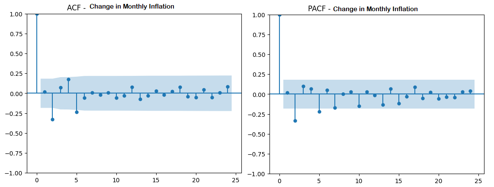

# Modeling Inflation Dynamics in Argentina

*Econometric analysis of the relationship between exchange-rate movements and inflation dynamics in Argentina using time-series models.*

This project develops a time-series model to analyze inflation dynamics in Argentina and examine their relationship with monthly exchange-rate movements.

The modeling strategy is inspired by the iterative **identification–estimation–diagnostic checking** logic of the Box–Jenkins methodology. Rather than focusing on forecasting, the analysis uses this iterative process to investigate the following research question:

> **Are monthly exchange-rate movements associated with changes in Argentina's inflation rate, and what are the temporal dynamics of this relationship?**

The analysis examines the stationarity properties of the series, identifies the dynamics of the conditional mean, tests for conditional heteroskedasticity, compares alternative model specifications, and evaluates the selected model through residual diagnostics.

The resulting specification is an **AR(2)-X-ARCH(2) model**, in which the change in monthly inflation is modeled using two autoregressive terms and the contemporaneous monthly percentage change in the exchange rate, while an ARCH(2) process captures conditional volatility.

The model is intended to characterize **statistical associations and temporal dynamics**, rather than identify a causal effect of exchange-rate movements on inflation.

## Data

The analysis uses **115 monthly observations covering the period from January 2017 to July 2026**, obtained from two official Argentine sources:

- **Consumer Price Index (CPI):** obtained from Argentina's National Institute of Statistics and Censuses (INDEC) and used to calculate the monthly inflation rate.
- **Exchange rate:** obtained from the Central Bank of Argentina (BCRA) and transformed into its monthly percentage variation.

The dataset was organized at a monthly frequency and checked for missing values and date consistency before the econometric analysis.

The main variables used in the modeling process are:

- `inflacion_mensual`: monthly inflation rate derived from the CPI.
- `variacion_dolar`: monthly percentage change in the exchange rate.
- `delta_inflacion`: change in the monthly inflation rate.

The latter is defined as:
Δπₜ = πₜ − πₜ₋₁

Therefore, `delta_inflacion` captures the **acceleration or deceleration of monthly inflation**, measured in percentage points.

## Tools and Technologies

- **Python**
  - **pandas** — data cleaning, transformation, and time-series preparation
  - **NumPy** — numerical operations
  - **statsmodels** — stationarity tests, ARIMA/ARIMAX estimation, Granger causality, Ljung–Box tests, and CUSUM diagnostics
  - **arch** — ARCH/GARCH estimation and volatility modeling
  - **Matplotlib** — time-series and diagnostic visualizations

---

## Methodology

The modeling strategy draws inspiration from the **Box–Jenkins methodology**, particularly its iterative logic of identification, estimation, diagnostic checking, and model re-specification.

Because the objective of this project is explanatory rather than forecasting-oriented, the forecasting stage was omitted.

The analysis followed the following process:

1. **Data preparation and transformation**
   - Monthly frequency and date consistency were verified.
   - CPI data were transformed into monthly inflation rates.
   - The exchange rate was transformed into monthly percentage changes.

2. **Stationarity analysis**
   - Augmented Dickey–Fuller (ADF) and KPSS tests were applied to assess the stationarity properties of the variables used in the analysis.
   - The monthly inflation rate (`inflacion_mensual`) showed ambiguous/non-stationary behavior.
   - The monthly inflation rate was therefore first-differenced, producing `delta_inflacion`, which measures the month-to-month change in the inflation rate in percentage points. This transformed series was found to be stationary.
   - For the exchange rate, the analysis used its monthly percentage variation (`variacion_dolar`) rather than the exchange-rate level. This series was found to be stationary and therefore did not require additional differencing.

3. **Identification of mean dynamics**
   - ACF and PACF plots were examined.
   - Alternative autoregressive specifications were compared using AIC and BIC.

4. **Incorporation of the exchange rate**
   - Monthly exchange-rate variation was included as an explanatory variable because the central research question concerns its relationship with inflation dynamics.
   - Alternative specifications with additional exchange-rate lags were also evaluated.

5. **Conditional heteroskedasticity**
   - ARCH-LM tests revealed evidence of ARCH effects.
   - ARCH(1), ARCH(2), and GARCH(1,1) specifications were estimated and compared.

6. **Model re-specification**
   - Although the volatility models captured conditional heteroskedasticity, residual autocorrelation indicated that the conditional mean remained under-specified.
   - AR(0), AR(1), and AR(2) mean specifications were therefore compared while retaining the exchange-rate variable and ARCH(2) variance structure.

7. **Final diagnostics**
   - Ljung–Box tests were applied to standardized residuals and squared standardized residuals.
   - ARCH-LM tests were used to check for remaining conditional heteroskedasticity.
   - ACF and PACF plots were inspected for remaining serial dependence.
   - CUSUM was used as an additional parameter-stability diagnostic.

8. **Granger causality**
   - Granger causality tests were used as a complementary analysis of the predictive relationship between exchange-rate movements and changes in inflation.
## Stationarity Results

Stationarity was assessed before model estimation to avoid modeling relationships between non-stationary series.

| Variable | Test | Statistic | p-value | Interpretation |
|---|---|---:|---:|---|
| Monthly inflation | ADF | -2.354 | 0.155 | Unit root cannot be rejected |
| Monthly inflation | KPSS | 0.381 | 0.085 | Stationarity is not rejected at 5% |
| Change in monthly inflation | ADF | -5.004 | <0.001 | Stationary |
| Change in monthly inflation | KPSS | 0.095 | >0.10 | Stationarity is not rejected |
| Monthly exchange-rate variation | ADF | -8.439 | <0.001 | Stationary |

The ADF and KPSS tests provided mixed evidence regarding the stationarity of the monthly inflation rate. After first-differencing the inflation rate, both tests supported treating the resulting series (`delta_inflacion`) as stationary.

The monthly percentage variation in the exchange rate (`variacion_dolar`) was also found to be stationary and was therefore included without additional differencing.

The transformation can also be observed visually in the time-series plots below.
### Monthly Inflation Rate

The monthly inflation rate exhibits substantial changes in its level and volatility over the sample, with particularly pronounced movements during 2023–2024.

### Change in Monthly Inflation

After first-differencing the monthly inflation rate, the resulting series fluctuates around zero, although periods of markedly higher volatility remain visible, particularly around 2023–2024. This visual pattern is consistent with the subsequent investigation of conditional heteroskedasticity. 
## Identification of Mean Dynamics

The ACF and PACF of `delta_inflacion` were examined to identify potential short-run dependence in the conditional mean.

The correlograms suggested short-run serial dependence, particularly around the second lag. Rather than selecting the autoregressive order solely from visual inspection, alternative specifications were subsequently compared using information criteria and residual diagnostics.
  
## Limitations and Further Research

The AR(2)-X-ARCH(2) specification models changes in monthly inflation as the dependent variable and includes contemporaneous exchange-rate variation as a regressor. Therefore, the estimated exchange-rate coefficient should be interpreted as a conditional statistical association rather than a causal effect.

Granger causality tests indicate bidirectional predictive relationships between exchange-rate movements and changes in inflation, suggesting that the two variables may interact dynamically rather than follow a strictly one-directional relationship.

A natural extension of this analysis would be to model inflation and exchange-rate dynamics jointly within a Vector Autoregression (VAR) framework and examine their dynamic responses through impulse-response functions.
